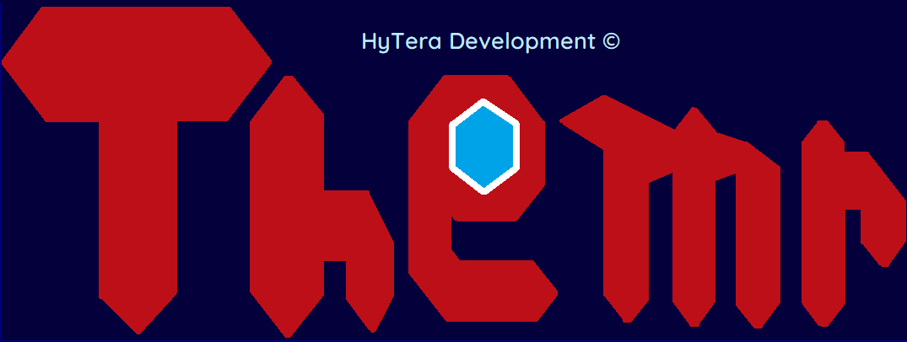

<p align="center">
    
  </a>
</p>

<h1 align="center">HyTera THEMR</h1>

<div align="center">

**The best web browser extension made to allow the power of customization in your own hands!**

The replacement of the old HyTesCord SUPERBLACK project.

[![HyTera Development Server][hytera-development-server]][hytera-development-server-url]
[![THEMR website][themr-website]][themr-website-url]

[hytera-development-server]: https://img.shields.io/discord/773352845738115102?color=5865F2&logo=discord&logoColor=white
[hytera-development-server-url]: https://discord.gg/GZQrhyjfXe
[themr-website]: https://img.shields.io/badge/THEMR-website-green
[themr-website-url]: https://themr.hdevelopment.tk/
    
</div>

# Table of Contents
1. - **[Features](#features)**
2. - **[Installation](#installation)**
3. - **[Setup](#setup)**
4. - **[Links](#links)**
5. - **[Contributtions](#collab)**

## Features <a name = "features">

  - Enables customization in a bunch of sites 
  - Community can make themes and publish them 
  - Customizable themes, where you can make your own themes 
  - Easy to use, simple controls 

## Installation <a name = "installation">

In order to install THEMR in your browser, you'll need to follow this guide: 


Step 1 : Download the repository as ZIP 

Step 2 : Once downloaded, unzip it

Step 3 : On your browser, go to extensions and enable Developer mode. then, click "Load unpacked"

Step 4 : Load THEMR files you downloaded, under the "Hytescord_superblack" folder        

## Setup <a name = "setup">

### First steps

first, download all required [Dependencies](#dependencies)

then, clone the repository using
```bash
gh repo clone NickHunterD3V/HytesCord-Themr
```
in your console/terminal

### Dependencies <a name = "dependencies">
  
Themr uses: 
 - Node.JS v18.x
 - NPM v7.20.x
 - JsDelivr CDN

NPM packages used by themr:
 - express.js
 - socket.io

Languages used on themr:
 - JavaScript
 - HTML5 
 - CSS 
 - TypeScript
 - PHP
 - PYTHON
    
## Links <a name = "links">
- [Website](https://themr.hdevelopment.tk/index.html)
- [Github](https://github.com/NickHunterD3V/HytesCord-Themr)
- [Discord Server](https://discord.gg/GZQrhyjfXe)

## Contributtions <a name = "collab">

the project is made by Hunter from HyTera Development

contributtors:
- Paebukoa
- Select

###### Made by HyTera Development ©


